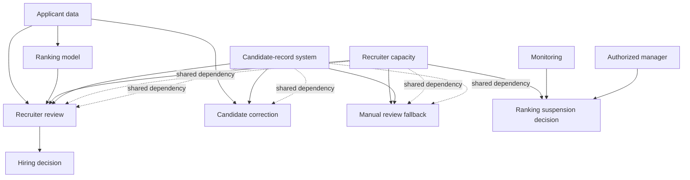

# Worked Example: Employment Screening

## 1. Purpose and context

An organization uses an AI ranking system to prioritize job applications for recruiter review.

The system does not formally make hiring decisions. However, it determines:

- which applications receive attention first;
- which applications may be delayed;
- which candidates may receive limited review; and
- which candidates are practically visible to recruiters.

The Reliance Lens pathway is:

```text
Signal
→ Interpretation
→ Authority
→ Oversight
→ Intervention
→ Recovery
→ Learning
```

The central question is:

> **Do ranking, human review, correction, and fallback remain operationally independent when recruiter capacity is degraded?**

## 2. Safeguard inventory

| Safeguard | Intended function | Required to operate |
|---|---|---|
| Applicant-data validation | Detect incomplete or inaccurate records | Current applicant data, validation rules |
| Ranking monitoring | Detect unusual ranking behaviour | Monitoring system, baseline data, analyst capacity |
| Recruiter review | Challenge or reject ranking outputs | Recruiter capacity, candidate records |
| Manual review fallback | Continue assessment without ranking | Recruiters, records, review procedure |
| Candidate correction process | Correct inaccurate applicant information | Communication channel, case records, responsible staff |
| Ranking suspension procedure | Stop ranking when conditions are unsafe | Detection signal, authorized decision-maker, technical switch |

## 3. Dependency map



## 4. Disruption scenario

Recruiter review capacity becomes unavailable or severely constrained while the ranking system remains technically available.

Illustrative causes include:

- an unexpected application surge;
- staff absence;
- insufficient trained reviewers;
- an unavailable review queue;
- a hiring freeze followed by rapid reopening; or
- competing operational priorities.

This is an analytical scenario, not a documented incident.

## 5. Reliance analysis

| Question | Finding |
|---|---|
| Does the ranking model remain technically available? | Yes |
| Does meaningful human review remain available? | No or materially degraded |
| Can the organization detect insufficient review capacity? | Unknown unless capacity monitoring exists |
| Does ranking continue during the loss of review? | Potentially yes |
| Does ranking acquire greater practical authority? | Yes |
| Does manual fallback remain independent? | No; it partly depends on the same recruiter capacity |
| Does candidate correction remain independent? | Possibly not |
| Can ranking be suspended? | Only if detection, authority, and technical controls remain available |
| Is an independent recovery path established? | Not established |

## 6. Nieleze pathway

### Signal

Recruiter capacity falls below the level required for timely and substantive review.

### Interpretation

The organization may interpret the event as a staffing issue rather than as a loss of an AI oversight control.

### Authority

The ranking output gains practical authority because it determines which applications receive scarce attention.

### Oversight

Recruiter review exists formally but is no longer sufficient to challenge the ranking.

### Intervention

Suspending ranking may require the same unavailable staff or an escalation process that is not monitored.

### Recovery

Manual review is not independent if it depends on the same recruiter capacity, records, and workflow.

### Learning

If the event is not recorded as a control failure, future assessments may incorrectly conclude that meaningful human oversight was present.

## 7. Reliance Lens finding

The control set contains multiple safeguards, but those safeguards are not operationally independent.

Recruiter review, manual fallback, candidate correction, and ranking suspension all depend partly on recruiter capacity and the candidate-record system.

When recruiter capacity is degraded:

- oversight becomes unavailable;
- manual fallback is also degraded;
- correction may be delayed;
- ranking can acquire practical authority; and
- the organization may not detect the authority transfer.

The material risk is therefore not only model error. It is **control coupling**: the same dependency can disable several safeguards at once.

## 8. Candidate measurement layer

The case also defines candidate quantities that could be measured in a controlled test. These are **not validated metrics**.

| Property | Candidate measure | Example |
|---|---|---|
| Dependency concentration | proportion of safeguards sharing a material dependency | 4/6 safeguards depend on recruiter capacity |
| Detection latency | time from capacity degradation to recognition of oversight failure | minutes / hours |
| Intervention latency | time from recognition to effective ranking restriction | minutes / hours |
| Control persistence | proportion of safeguards remaining effective after perturbation | 2/5 remain effective |
| Recovery time | time to restore meaningful review | hours / days |
| Residual authority | degree of consequential ranking authority retained while review is degraded | ordinal / scenario-based |

A future empirical study would test whether these constructs are measurable, repeatable between assessors, and discriminative across contrasting system designs.

## 9. Operational value

This case demonstrates four uses of Reliance Lens.

### It changes the unit of analysis

Instead of asking:

> Is there a human in the loop?

It asks:

> Is the human review function available, adequately resourced, authorized, and capable of changing the result under current operating conditions?

### It reveals a failure invisible in a static control inventory

A static inventory may state:

```text
Model monitoring: present
Human review: present
Manual fallback: present
Appeal process: present
```

Reliance Lens reveals:

```text
Recruiter capacity failure
→ review degraded
→ fallback degraded
→ correction delayed
→ ranking authority increases
```

### It distinguishes formal authority from practical authority

The organization may state that recruiters make hiring decisions. Under stress, however, the ranking system may determine which candidates are ever meaningfully considered.

This is an **authority transfer without a formal transfer of authority**.

### It identifies the next control to test

The concrete operational question is:

> Does the system automatically stop or restrict ranking when meaningful recruiter review is unavailable?

## 10. Minimal operational test

### Test: Loss of meaningful human review

**Trigger**  
Reduce available recruiter-review capacity below the minimum needed for timely and substantive review.

**Observe**

1. Does the organization detect the capacity loss?
2. Does ranking automatically pause or become restricted?
3. Is the authorized decision-maker notified?
4. Can applications be routed to an independent review path?
5. Can candidate corrections still be processed?
6. Is the event recorded as an oversight-control failure?
7. Can normal operation be restored and explained?

**Pass condition**  
Ranking cannot continue as an effective gatekeeper unless meaningful review, intervention authority, and a usable recovery path remain available.

**Failure condition**  
Ranking continues while review, fallback, or recourse is materially unavailable and no escalation occurs.

## 11. Evidence boundary

### Documented within this artifact

- The case definition;
- the system purpose;
- the listed safeguards;
- the disruption scenario; and
- the analytical pathway.

### Inferred

- Recruiter review and manual fallback share recruiter-capacity dependence;
- ranking may acquire practical authority when review is unavailable; and
- control coupling may produce common-mode failure.

### Hypothesized

- The organization may fail to detect the authority transfer; and
- candidate correction may degrade with review capacity.

### Testable

- Whether ranking continues below a review-capacity threshold;
- whether a suspension mechanism exists;
- whether manual fallback uses independent capacity;
- whether applicants can still obtain correction or recourse; and
- whether the event is recorded as an oversight-control failure.

### Not established

- That this pattern occurred in a particular organization;
- that Reliance Lens improves outcomes;
- that the method is reliable between assessors; or
- that the method is superior to existing AI RMF practice.

## 12. Conclusion

This worked case demonstrates how Reliance Lens can translate a qualitative human-oversight claim into a dependency-specific analysis and a testable assurance procedure. It identifies how several safeguards may fail together and produces a concrete disruption exercise.

It does not establish that the method is validated, reproducible between assessors, or superior to existing AI RMF practice.
